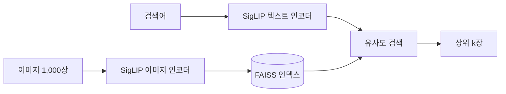

# 5주차 멀티모달 검색 - 김민석

SigLIP + FAISS로 텍스트→이미지 검색을 만들고, **한국어로 검색하면 왜 성능이 떨어지는지, 어떻게 올릴 수 있는지**를 실험했다.

## 요약

- 한국어로 검색하면 영어보다 R@1이 **26~32%p** 낮다.
- 질의를 영어로 번역해 원래 질의와 섞으면 학습 없이 **+11~16%p** 오른다.
- 번역 캡션으로 파인튜닝하면 번역 캡션 평가에서 **+23%p**(0.450 → 0.680) 오른다.
- 하지만 번역을 거치지 않은 질의로 다시 재보면 **+5%p**에 그쳤고, 학습 안 한 so400m이 더 좋았다.
- 학습과 평가를 같은 번역기로 만들면 결과가 부풀려질 수 있다.

## 실험 환경

| 항목 | 내용 |
|---|---|
| 데이터 | Flickr8k test 1,000장 (이미지당 영어 캡션 5개) |
| 한국어 캡션 | caption_0을 NLLB(`nllb-200-distilled-600M`)로 번역 |
| 벡터DB | FAISS `IndexFlatIP` (L2 정규화 후 내적 = 코사인 유사도) |
| 모델 | SigLIP v1 multilingual base, SigLIP2 base, SigLIP2 so400m |
| 평가 | Recall@K: 캡션으로 검색했을 때 원래 사진이 상위 K장 안에 든 비율 |
| 환경 | Colab T4 |

---

## 1. 기본 파이프라인과 모델 비교

| 모델 | 영어 R@1 | 한국어 R@1 | 인덱싱 시간 |
|---|---|---|---|
| SigLIP v1 multilingual | 0.699 | 0.434 | 17초 |
| SigLIP2 base | 0.769 | 0.450 | 16초 |
| SigLIP2 so400m | **0.816** | **0.541** | 223초 |

- 같은 크기에서 SigLIP2가 v1보다 영어 R@1이 7%p 높다.
- 그런데 한국어에서는 차이가 1.6%p뿐이다. 영어 성능 향상이 한국어까지 이어지지 않았다.

## 2. 한국어 검색이 약한 이유

so400m에서 **"원반을 잡는 개"** 로 검색하면 상위 5장에 원반 사진이 하나도 없었다. **"프리스비를 잡는 개"** 로 바꾸니 5장 모두 맞았다.

한국어 웹에서는 이 물건을 대부분 "프리스비"라고 부르기 때문으로 보인다. 한국어 성능은 모델의 언어 능력뿐 아니라 **어떤 단어를 쓰느냐**에도 크게 좌우된다.

## 3. 학습 없이 성능 올리기

| 질의 넣는 방식 (한국어 R@1) | v1 | SigLIP2 base | so400m |
|---|---|---|---|
| 한국어 그대로 | 0.434 | 0.450 | 0.541 |
| 영어로 번역해서 | 0.543 | 0.593 | 0.633 |
| 한국어 + 번역 벡터 섞기 | **0.564** | **0.607** | **0.652** |

- 같은 문장을 영어로 바꿔 넣기만 해도
