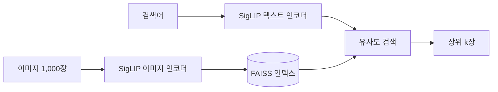

# 5주차 멀티모달 검색 - 김민석

SigLIP + FAISS로 텍스트→이미지 검색을 만들고, **한국어로 검색하면 왜 성능이 떨어지는지, 어떻게 올릴 수 있는지**를 실험했다.

## 요약

- 한국어로 검색하면 영어보다 R@1이 **26~32%p** 낮다.
- 질의를 영어로 번역해 원래 질의와 섞으면 학습 없이 **+11~16%p** 오른다.
- 번역 캡션으로 파인튜닝하면 번역 캡션 평가에서 **+23%p**(0.450 → 0.680) 오른다.
- 하지만 번역을 거치지 않은 질의로 다시 재보면 **+5%p**에 그쳤고, 학습 안 한 so400m이 더 좋았다.
- 학습과 평가를 같은 번역기로 만들면 결과가 부풀려질 수 있다.

## 실험 환경

| 항목 | 내용 |
|---|---|
| 데이터 | Flickr8k test 1,000장 (이미지당 영어 캡션 5개) |
| 한국어 캡션 | caption_0을 NLLB(`nllb-200-distilled-600M`)로 번역 |
| 벡터DB | FAISS `IndexFlatIP` (L2 정규화 후 내적 = 코사인 유사도) |
| 모델 | SigLIP v1 multilingual base, SigLIP2 base, SigLIP2 so400m |
| 평가 | Recall@K: 캡션으로 검색했을 때 원래 사진이 상위 K장 안에 든 비율 |
| 환경 | Colab T4 |

---

## 1. 기본 파이프라인과 모델 비교

| 모델 | 영어 R@1 | 한국어 R@1 | 인덱싱 시간 |
|---|---|---|---|
| SigLIP v1 multilingual | 0.699 | 0.434 | 17초 |
| SigLIP2 base | 0.769 | 0.450 | 16초 |
| SigLIP2 so400m | **0.816** | **0.541** | 223초 |

- 같은 크기에서 SigLIP2가 v1보다 영어 R@1이 7%p 높다.
- 그런데 한국어에서는 차이가 1.6%p뿐이다. 영어 성능 향상이 한국어까지 이어지지 않았다.

## 2. 한국어 검색이 약한 이유

so400m에서 **"원반을 잡는 개"** 로 검색하면 상위 5장에 원반 사진이 하나도 없었다. **"프리스비를 잡는 개"** 로 바꾸니 5장 모두 맞았다.

한국어 웹에서는 이 물건을 대부분 "프리스비"라고 부르기 때문으로 보인다. 한국어 성능은 모델의 언어 능력뿐 아니라 **어떤 단어를 쓰느냐**에도 크게 좌우된다.

## 3. 학습 없이 성능 올리기

| 질의 넣는 방식 (한국어 R@1) | v1 | SigLIP2 base | so400m |
|---|---|---|---|
| 한국어 그대로 | 0.434 | 0.450 | 0.541 |
| 영어로 번역해서 | 0.543 | 0.593 | 0.633 |
| 한국어 + 번역 벡터 섞기 | **0.564** | **0.607** | **0.652** |

- 같은 문장을 영어로 바꿔 넣기만 해도 9~14%p 오른다. 모델이 한국어 문장을 영어만큼 이해하지 못한다는 뜻이다.
- 두 벡터를 섞으면 조금 더 오른다. (섞는 비율은 test로 골랐기 때문에 실제보다 약간 높을 수 있다)
- 모델 두 개를 합치는 앙상블은 so400m 단독 대비 +0.9%p가 최대였다. 비용 대비 효과가 없었다.

영어/한국어 결과 일관성 (펼치기)

같은 뜻의 영어·한국어 질의 20쌍에서 상위 5장이 몇 장 겹치는지 셌다.

| 모델 | 평균 겹침 (최대 5) |
|---|---|
| SigLIP v1 multilingual | 2.90 |
| SigLIP2 base | 2.05 |
| SigLIP2 so400m | 2.30 |

정확도와 순위가 반대다. v1은 정확도는 가장 낮지만 언어가 바뀌어도 비슷한 사진을 고른다. 겹침이 0이라고 꼭 실패는 아니었다. "kids having fun outside"와 "밖에서 신나게 노는 애들"은 겹침이 0이었지만 결과 10장 모두 밖에서 노는 아이 사진이었다.

## 4. 한국어 캡션으로 파인튜닝

SigLIP2 base를 골랐다. 번역 후 검색에서 가장 크게 회복된 모델이라, 이미지 이해는 괜찮고 한국어 텍스트 쪽이 약하다고 봤다.

| 설정 | 내용 |
|---|---|
| 학습 대상 | 텍스트 인코더만 (이미지 인코더, 토큰 임베딩 고정 / 85.7M 파라미터) |
| 학습 데이터 | Flickr8k train 6,000장 × 캡션 5개 번역 = 30,000쌍 + 영어 원문 같은 양 |
| 손실 | SigLIP sigmoid loss |
| 설정 선택 | 학습률·epoch는 validation으로 고르고 test는 마지막에 한 번만 평가 |
| 최종 설정 | lr 3e-5, 3 epoch (epoch당 약 170초) |

**test 결과 (번역 캡션 기준)**

| | 한국어 R@1 | 한국어 R@5 | 영어 R@1 |
|---|---|---|---|
| 원래 | 0.450 | 0.693 | 0.769 |
| 파인튜닝 | **0.680** | **0.893** | 0.776 |

한국어가 23%p 오르고 영어는 떨어지지 않았다. base 모델 하나로 so400m 질의 섞기(0.652)보다 높고, 검색할 때 번역도 필요 없다.

학습률 비교 표 (펼치기)

val R@1 기준.

| 학습률 | 한국어 최고 | 그때 영어 | 최고 epoch |
|---|---|---|---|
| 1e-6 | 0.616 | 0.801 | 2 |
| 5e-6 | 0.667 | 0.811 | 2 |
| 1e-5 | 0.680 | 0.807 | 2 |
| 3e-5 | 0.693 | 0.788 | 3 |
| 학습 전 | 0.466 | 0.767 | - |

- 학습률이 클수록 한국어는 오르고 영어는 5e-6을 넘으면서 내려간다.
- 같은 설정으로 다시 학습하면 0.5~1%p 정도 흔들려서, 1e-5와 3e-5의 차이는 이 범위 안이다.

**검색 결과로 본 변화**

- "원반을 잡는 개": 학습 전 so400m 0/5 → 파인튜닝 후 **4/5**. 다만 학습 데이터 번역에는 "원반"이 0번, "프리스비"가 231번 나왔다. "원반"이라는 단어를 배운 게 아니라, 이 데이터에서 "개가 뭔가를 잡는" 사진은 대부분 프리스비라는 걸 배운 것으로 보인다.
- "빨간 셔츠를 입은 아이": 빨간 방망이를 든 아이, 빨간 음료가 묻은 아이가 섞여 나왔다. 색이 어디에 붙어 있는지 구분하지 못하는 건 이런 모델의 원래 약점이라 한국어 학습으로는 안 고쳐진다.

## 5. 번역을 거치지 않은 질의로 다시 평가

4번은 번역 캡션으로 학습하고 번역 캡션으로 평가했다. 그래서 한국어를 잘하게 된 건지, 번역기 말투에 익숙해진 건지 구분이 안 된다. 확인하려고 test 이미지 40장을 무작위로 골라 사진만 보고 한국어 검색어를 새로 썼다. (검색어는 Claude가 사진을 보고 작성, 영어 캡션은 보지 않음)

| 모델 | 번역 캡션 R@1 | 새로 쓴 질의 R@1 |
|---|---|---|
| SigLIP2 base 원래 | 0.450 | 0.625 |
| SigLIP2 base 파인튜닝 | **0.680** | 0.675 |
| SigLIP2 so400m 원래 | 0.541 | **0.725** |

- 파인튜닝 효과가 +23%p에서 **+5%p**(40개 중 2개)로 줄었다.
- 학습 안 한 so400m이 가장 좋았다.
- 4번의 큰 상승은 상당 부분 **번역기 말투에 맞춰진 효과**였을 가능성이 크다.

두 평가의 절대값은 비교하면 안 된다. 새로 쓴 질의는 사진마다 구분되는 특징을 넣어서 원래 캡션보다 찾기 쉽다.

질의별로 크게 바뀐 사례 (펼치기)

40개 중 26개는 순위가 같고, 8개는 좋아지고, 6개는 나빠졌다. (숫자는 정답 사진의 순위)

| 질의 | 원래 | 파인튜닝 |
|---|---|---|
| 무대 위에서 단체로 춤 공연하는 아이들 | 4 | 1 |
| 철망 앞에서 헬멧 쓰고 야구하는 아이 | 4 | 1 |
| 카시트에 앉아서 놀란 표정 짓는 남자애 | 3 | 1 |
| 개 묘기 대회에서 원반 잡으려고 뛰는 개 | 2 | 1 |
| 물 위로 물보라 일으키며 낙하산 타는 사람 | 1 | 8 |
| 하얀 벽 앞에 멀찍이 떨어져 서 있는 두 사람 | 2 | 4 |

"낙하산" 질의가 떨어진 이유는 확인하지 못했다. 학습 데이터에서 parasail은 14문장 모두 "낙하산"으로 번역돼 있어서, 번역 단어 문제는 아니다.

40개 전체 순위는 노트북의 `[재평가]` 셀 출력에 있다.

---

## 결론

| 상황 | 추천 |
|---|---|
| 정확도가 제일 중요할 때 | so400m + 질의를 영어로 번역해서 섞기 |
| 가볍고 빨라야 할 때 | SigLIP2 base + 질의 번역 |
| 파인튜닝을 쓰고 싶을 때 | 번역 데이터 말고 실제 사용자 질의로 따로 검증하고 쓰기 |

## 막힌 점

**1. 번역 pipeline이 동작하지 않았다**
Colab의 transformers 버전에서 `pipeline("translation")`이 안 돌아갔다. NLLB 토크나이저와 모델을 직접 불러오고 `forced_bos_token_id`로 출력 언어를 지정해서 해결했다.

**2. 한국어가 나쁜 이유가 모델인지 번역인지 구분하기 어려웠다**
"원반"과 "프리스비" 사례로 단어 선택 문제를 처음 알았다. 이걸 확인하려고 번역 후 검색, 파인튜닝, 번역을 거치지 않은 질의 평가까지 이어서 해봤다.

## 파일 구성

| 파일 | 내용 |
|---|---|
| `README.md` | 실험 정리 (이 문서) |
| `TAVE_Week_5.ipynb` | 전체 코드와 실행 결과. 셀마다 `[번역]`, `[인덱싱]`, `[최종 학습]`처럼 단계 이름 주석이 있어서 위 번호와 맞춰 볼 수 있다 |

검색 결과 이미지, Recall 표, 학습률 그래프는 모두 노트북 셀 출력에 들어 있다.
