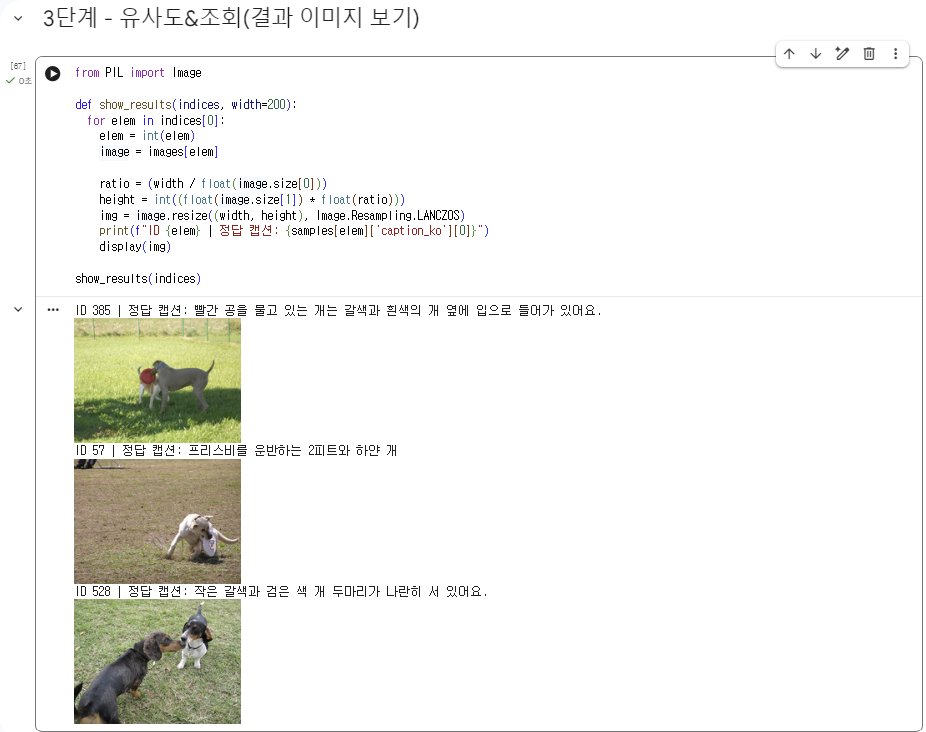
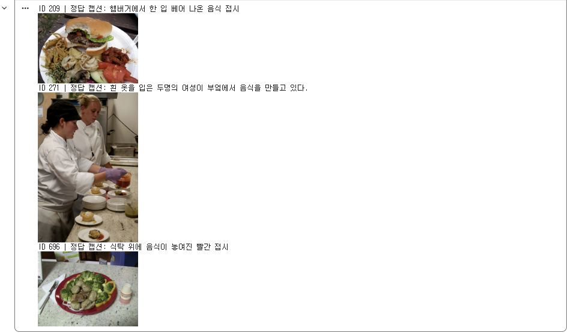

# 서태영의 week5-multimodal-search 실습

SigLIP으로 이미지를 임베딩해 FAISS에 저장하고, 영어·한국어 텍스트 질의로 이미지를 검색하는 파이프라인을 구현했다.
베이스 노트북은 smol-vision의 [`Image_Search_with_MetaCLIP2.ipynb`](https://github.com/merveenoyan/smol-vision/blob/main/Image_Search_with_MetaCLIP2.ipynb)이고, 모델을 SigLIP으로 바꿨다.

## 과제 체크리스트

- [x] 1. 캡션이 있는 이미지 데이터셋 불러오기 (COCO val2014 1,000장)
- [x] 2. SigLIP 이미지 임베딩 → FAISS 인덱스 저장
- [x] 3. 텍스트 질의 → FAISS 검색 → 상위 k장 출력 (영어·한국어)
- [x] 4. Recall@K 계산 (영어·한국어 비교)

## 사용 환경

| 항목 | 내용 |
|---|---|
| 모델 | `google/siglip-base-patch16-256-multilingual` (임베딩 차원 768) |
| 벡터 DB | FAISS `IndexFlatL2` (L2 정규화 후 사용) |
| 실행 환경 | Google Colab (GPU) |

## 사용 데이터셋

[AI-Hub 한국어 이미지 설명 데이터셋](https://www.aihub.or.kr/aihubdata/data/view.do?dataSetSn=261)

- MS COCO 2014 캡션(이미지 약 12만 장)의 영어 캡션을 한국어로 기계번역한 뒤 오류를 수정한 데이터
- 이미지마다 영어 캡션(`captions`)과 한국어 캡션(`caption_ko`)이 보통 5개씩 같은 순서로 짝지어져 있다
- JSON에는 캡션과 이미지 경로만 있고 이미지 파일은 없어서, 경로를 이용해 COCO 서버(`images.cocodataset.org`)에서 필요한 이미지만 받았다
- `val2014`에서 무작위 1,000장을 사용했다 (`random.seed(42)`로 고정)

```json
{
  "file_path": "val2014/COCO_val2014_000000391895.jpg",
  "id": 391895,
  "captions":   ["A man with a red helmet on a small moped on a dirt road.", "..."],
  "caption_ko": ["빨간 헬멧을 쓴 남자가 작은 모터 달린 비포장 도로를 달려 있다.", "..."]
}
```

**이 데이터를 고른 이유:** 같은 이미지에 영어와 한국어 캡션이 짝지어져 있어서, 언어만 바꿨을 때의 검색 성능 차이를 공정하게 비교할 수 있다.

## 파이프라인

```
[오프라인 인덱싱: 한 번만]
이미지 1,000장 → SigLIP 이미지 인코더 → 768차원 벡터 → L2 정규화 → FAISS에 add (ID 0~999)

[온라인 추론: 질의마다]
텍스트 질의 → SigLIP 텍스트 인코더 → 768차원 벡터 → L2 정규화 → index.search → 상위 k개 ID → 이미지 조회
```

- FAISS ID는 `add`한 순서대로 붙으므로 `index ID = images 순서 = samples 순서`가 유지된다
- 벡터를 정규화했기 때문에 L2 거리 순위와 코사인 유사도 순위가 같다

## MetaCLIP2 → SigLIP 전환 시 바꾼 점

| 원본 코드 | 변경 | 이유 |
|---|---|---|
| `from transformers import infer_device` | 장치 선택 코드 직접 작성 | transformers 버전 차이로 import 에러 |
| `model.config.projection_dim` | `model.config.vision_config.hidden_size` | SigLIP은 projection 레이어가 없어 해당 항목이 없음 |
| `faiss.IndexFlatL2(1280)` | `faiss.IndexFlatL2(768)` | 모델마다 임베딩 차원이 다름 |
| `get_image_features(...)` 결과 바로 사용 | `.pooler_output`으로 텐서 꺼내기 | 최신 transformers는 출력 객체를 반환 |
| `tokenizer([prompt], return_tensors="pt")` | `padding="max_length", truncation=True` 추가 | SigLIP은 max_length 패딩으로 학습됨. 빠뜨리면 에러 없이 품질만 떨어짐 |
| `load_dataset("merve/food")` | AI-Hub JSON + COCO 이미지 | 16장, 캡션 없음 → Recall@K 계산 불가 |

## 결과

### 1. 텍스트 질의 검색

| 질의 | 결과 |
|---|---|
| `잔디 위의 강아지` |  |
| `a plate of food` |  |

### 2. Recall@K (후보 1,000장, 이미지당 첫 번째 캡션 기준)

캡션으로 검색했을 때 그 캡션의 원래 사진이 상위 K장 안에 든 비율이다.

| | EN | KO | 차이 |
|---|---|---|---|
| R@1 | 0.621 | 0.423 | 19.8%p |
| R@5 | 0.854 | 0.720 | 13.4%p |
| R@10 | 0.921 | 0.832 | 8.9%p |

- 무작위로 고르면 R@1 = 0.1%, R@10 = 1%이므로 두 언어 모두 검색이 잘 작동한다
- 한국어가 영어보다 낮지만, K가 커질수록 격차가 줄어든다. 한국어 질의는 정답을 아예 놓치기보다 **순위가 밀리는** 경우가 많다
- 원래 짝지어진 사진 1장만 정답으로 치기 때문에, 비슷한 다른 사진이 1위로 나와도 오답 처리된다. 실제 검색 품질은 R@1보다 좋을 수 있다

## 분석: 왜 영어가 한국어보다 성능이 좋을까?

가설은 두 가지였다.

1. **모델:** SigLIP은 웹의 "사진 + 설명" 쌍으로 학습하는데, 웹 데이터가 영어 위주라 한국어 텍스트의 정렬이 덜 정밀하다
2. **데이터:** 영어 캡션은 사람이 사진을 보고 쓴 문장이고, 한국어 캡션은 기계번역 후 수정한 문장이라 정보가 손실될 수 있다

### 실패 사례 확인

영어는 1위로 맞혔지만 한국어는 틀린 사례 10개를 직접 읽고 분류했다.

| 분류 | 개수 | 사례 |
|---|---|---|
| 번역이 틀림 (데이터 탓) | 4 | [2] skiers → "스키", [19] stoves → "난로", [34] close up → "닫아라", [38] Jet2 airplane → "제트 2기" |
| 번역이 어색함 | 2 | [11] "가운데"가 걸리는 곳이 애매함, [20] icing → "당의" |
| 번역이 자연스러운데 틀림 (모델 탓) | 4 | [9] 테니스, [17] 해변에서 말 타는 남자들, [18] 도넛에 초콜릿, [42] 망가진 휴대폰 |

### 오역을 고쳐서 다시 검색

| ID | 고친 문장 | 원래 번역 | 고친 문장의 정답 순위 |
|---|---|---|---|
| [19] | 피자 가게 주방의 오븐과 선반 위에 놓인 피자 상자 | 1위 아님 | **1위** |
| [38] | 활주로 가장자리에 세워진 Jet2 비행기 | 1위 아님 | **1위** |
| [34] | 피자 가장자리와 접시에 인쇄된 글자를 가까이서 찍은 사진 | 1위 아님 | 2위 |
| [2] | 스키 타는 사람들이 있는 산 | 1위 아님 | 3위 |

### 결론

- 오역 4개를 고치자 2개는 1위, 2개는 2~3위로 올라왔다 → 한국어 성능 격차의 일부는 **번역 데이터 품질** 때문이다
- 번역이 자연스러운데도 틀린 사례가 남아 있다 → **모델의 한국어 이해 부족**도 함께 작용한다
- 한계: 확인한 사례가 10개, 수정한 문장이 4개뿐이라 경향 정도로만 해석해야 한다. 또 고친 문장은 영어 원문의 정보를 되살린 것이라 원래 번역보다 단서가 많다

## 막힌 점

1. **베이스 노트북과 환경의 transformers 버전 차이**
   - `infer_device` import 에러, `get_image_features`가 텐서 대신 `BaseModelOutputWithPooling` 객체를 반환해 `.detach()` 에러가 났다
   - 장치 선택 코드를 직접 작성하고, `.pooler_output`으로 텐서를 꺼내 해결했다
2. **MetaCLIP2와 SigLIP의 구조 차이**
   - SigLIP config에는 `projection_dim`이 없었다. SigLIP은 별도 projection 레이어 없이 풀링 출력을 그대로 임베딩으로 쓰기 때문에 `hidden_size`(768)가 임베딩 차원이다
   - 텍스트 처리에 `padding="max_length"`가 필요하다는 것도 SigLIP만의 차이였다

## 더 해볼 것

- 이미지당 캡션 5개를 모두 질의로 사용해 Recall@K를 더 안정적으로 측정하기
- 후보 이미지 수(1,000 → 5,000)에 따른 Recall@K 변화 보기
- 관계(개가 고양이를 쫓음 vs 고양이가 개를 쫓음), 부정(차가 없는 거리), 개수 같은 어려운 질의로 모델의 한계 확인하기
- 사람이 직접 쓴 한국어 캡션 데이터로 다시 평가하기

## 파일 구성

```
week5-multimodal-search/서태영/
├── README.md
├── smol_vision_siglip.ipynb
└── images/          # 결과 캡처
```

> AI-Hub 원본 JSON은 용량이 크고 재배포 제한이 있을 수 있어 포함하지 않았다.
